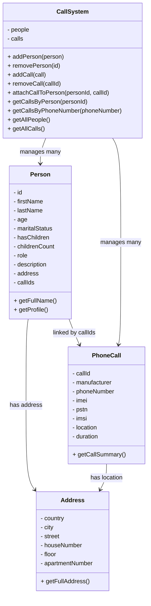

# Avatar Phone Call Tracking System - Design

## Goal

Build an in-memory JavaScript system for managing phone-call tracking data for key people in the Fire Nation.

The system should support:

- Adding people
- Removing people
- Adding phone calls
- Removing phone calls
- Attaching a phone call to a person
- Getting a call report by person
- Getting a call report by phone number

The first version focuses only on backend/system logic. UI will be built separately later.

---

## Main Design Idea

The system is divided into small classes, each with a clear responsibility:

- `Address` stores reusable address/location data.
- `Person` stores information about a person.
- `PhoneCall` stores information about a phone call.
- `CallSystem` manages people, calls, relationships, and reports.

This keeps the UI separate from the backend logic. The UI should call methods on `CallSystem`, but should not directly manage the internal arrays.

---

## Classes

### Address

Responsible for storing address/location data.

Properties:

- `country`
- `city`
- `street`
- `houseNumber`
- `floor`
- `apartmentNumber`

Methods:

- `getFullAddress()`

---

### Person

Responsible for storing person data.

Properties:

- `id`
- `firstName`
- `lastName`
- `age`
- `maritalStatus`
- `hasChildren`
- `childrenCount`
- `role`
- `description`
- `address`
- `callIds`

Methods:

- `getFullName()`
- `getProfile()`

Notes:

- `address` is an `Address` object.
- `callIds` stores the IDs of calls attached to this person.
- Calls are stored by ID instead of storing full call objects inside the person. This keeps the data simpler and easier to save/load later.

---

### PhoneCall

Responsible for storing phone-call data.

Properties:

- `callId`
- `manufacturer`
- `phoneNumber`
- `imei`
- `pstn`
- `imsi`
- `location`
- `duration`

Methods:

- `getCallSummary()`

Notes:

- `location` is an `Address` object.
- `callId` is added even though it is not explicitly listed in the exercise. It helps identify, delete, and attach a specific call.

---

### CallSystem

Responsible for managing the system state and operations.

Properties:

- `people`
- `calls`

Methods:

- `addPerson(person)`
- `removePerson(id)`
- `addCall(call)`
- `removeCall(callId)`
- `attachCallToPerson(personId, callId)`
- `getCallsByPerson(personId)`
- `getCallsByPhoneNumber(phoneNumber)`
- `getAllPeople()`
- `getAllCalls()`

Notes:

- `CallSystem` owns the main arrays.
- Other code should use methods instead of directly changing `people` and `calls`.
- Duplicate people are prevented by `id`.
- Duplicate calls are prevented by `callId`.

---

## Relationships

- A `Person` has one `Address`.
- A `PhoneCall` has one `Address` as its location.
- A `CallSystem` has many `Person` objects.
- A `CallSystem` has many `PhoneCall` objects.
- A `Person` can be attached to many calls through `callIds`.

---

## UML Class Diagram

---

## SOLID Notes

### Single Responsibility Principle

Each class has one main job:

- `Address` handles address data.
- `Person` handles person data.
- `PhoneCall` handles call data.
- `CallSystem` handles system operations.

### Open/Closed Principle

The design can be extended later without rewriting everything.

For example, adding file persistence or a database can be done separately from the core model classes.

### Separation Between UI and Backend

The backend logic should be inside the classes and especially inside `CallSystem`.

The UI should only collect user input and call system methods.

Example:

- UI asks user for person details.
- UI creates a `Person`.
- UI calls `system.addPerson(person)`.

The UI should not directly push into `system.people`.

---

## Future Extensions

Possible later additions:

- Hierarchical role reports
- Saving/loading data with JSON
- Database persistence
- Console UI
- Web UI